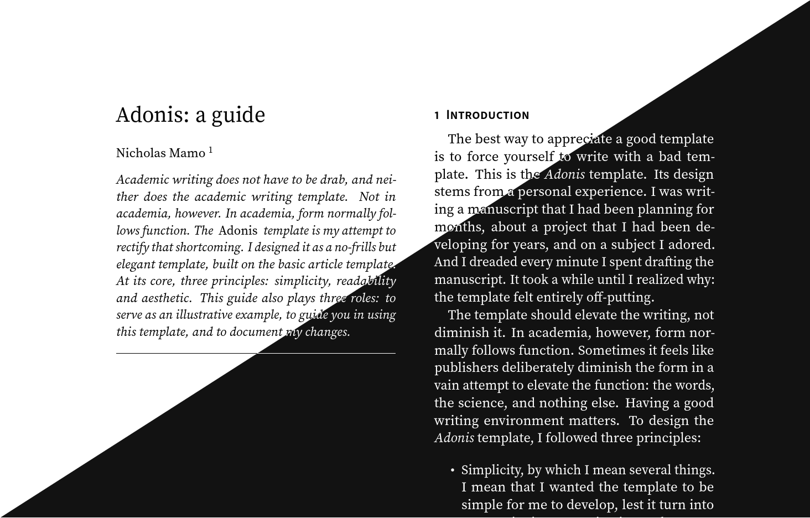
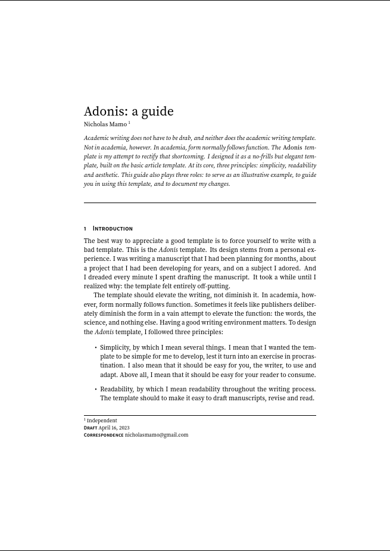

# Adonis: a LaTeX template

A simple, elegant LaTeX template with dark mode support.

## Description

Adonis is a LaTeX template designed to prioritize both form and function.
The template extends the base _article_ template with a new layout, new typography and other miscellaneous changes.
The goal: to make writing, revising and reading journal articles and conference proceeding papers a more artistic endeavor.
At its core, Adonis has three principles: simplicity, readability and aesthetic.

## Getting Started

If you are only interested in writing, you can copy `quickstart.tex`.
The preamble consists of optional commands to make full use of the template.
If you want to learn more about the `adonis` theme, you can read the `docs.pdf` file.

By default, the template uses a one-column layout.
However, you can change how it looks using the following options in the preamble:

- `dark`: use a dark background and light foreground
- `legacy`: add backwards compatibility for missing fonts in old versions of TeX Live
- `twocolumn`: use a two-column layout
- `wide`: give the text wider space by using narrower margins

### Dependencies

* LaTeX

### Installing

The easiest way to get started is by cloning this repository and editing `quickstart.tex`.
Alternatively, you can download the `adonis.cls` class and place it in the same directory as your `.tex` file.
Set the _Adonis_ document class in the preamble: `\documentclass{adonis}`.

## Help

To learn more about what motivated Adonis, the choices that informed its design, and how you can use the template, read `docs.pdf`.
If you find any issues, or if you have suggestions to make Adonis better, you can open an issue on this repository.

## Authors

- [Nicholas Mamo](https://github.com/NicholasMamo/)

## License

This project is licensed under the MIT License.
See the LICENSE.md file for details.

## Acknowledgments

* [DomPizzie](https://gist.github.com/DomPizzie) for the [README.md template](https://gist.github.com/DomPizzie/7a5ff55ffa9081f2de27c315f5018afc)
* [inuzm](https://github.com/inuzm) for suggesting the Noto font for math text
